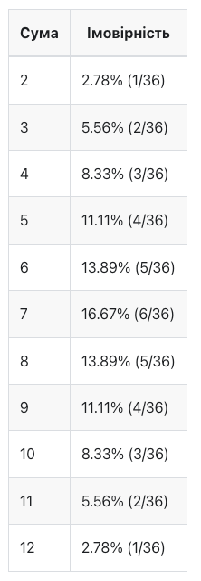
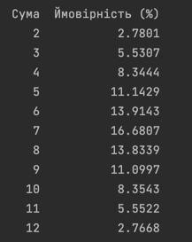
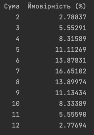

# goit-algo-fp
homework for GoIT Neoversity Data Science MSc Course

### Коментар до завдання 7
За допомогою методу Монте-Карло рахували вірогідність випадіння певної суми при
підкиданні двох кубиків. 

Аналітичні розрахунки:

Маємо результати з 1,000,000 підкидань:

Результати приблизно збігаються з аналітичними розрахунками, хоча в деяких
перший знак після коми уже відрізняється. Тож можна зробити висновок, що застосування
методу тут валідне, але потребує більшої кількості підкидань.
Так, з 10,000,000 підкидань уже маємо збіг першого знаку після коми у всіх випадках:

